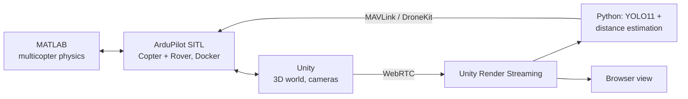

# Simulated Drone with Camera

Diploma thesis, Electrical & Computer Engineering, University of Thessaly (2024–2025).

A quadcopter simulation platform that couples a **Unity** visual environment, **ArduPilot SITL** flight control and a **MATLAB** physics engine. A **YOLO** detector plus a camera-geometry distance estimator let the drone follow a moving ground vehicle autonomously, adjusting altitude, position and yaw in real time.

[](https://youtu.be/cW9KFUT225E)

## Highlights

- **Full simulation stack:** Unity (rendering, multi-camera), ArduPilot SITL in Docker for a Rover and a Copter, and MATLAB for the multicopter physics.
- **Real-time detection and distance estimation:** YOLO11 detects the vehicle; distance is computed from the bounding box using camera height, tilt, focal length and sensor size.
- **Autonomous following:** a Python controller (DroneKit / MAVLink) adjusts altitude, position and yaw to track the target.
- **Browser video streaming:** Unity Render Streaming (WebRTC) delivers the camera feed to the browser.
- **Performance:** the detection and control loop runs at **45 FPS**, and the browser stream at **30 FPS**.

## Architecture



## Repository structure

| Directory | Contents |
|---|---|
| `Ardupilot/` | ArduPilot code and configuration |
| `Drone/` | Unity project (scenes, assets, multi-camera setup) |
| `ML/` | `main.py` (tracking loop), `DistanceEstimator.py` (YOLO11 + camera geometry), `DroneMovement.py` (DroneKit control) |
| `MyMission/` | Rover and Copter mission files and parameters |
| `Physics/` | MATLAB multicopter simulation and the SITL connector |
| `UnityRenderStreaming/` | WebRTC streaming server |

## Running the project

### 1. Start Unity
Open the `Drone` project in Unity and launch the scene.

### 2. Start MATLAB
```sh
cd Physics
```
```matlab
Copter_SIM_multicopter("copter.json")
```

### 3. Start the Docker containers (Rover and Drone)
Two separate containers are required.

```sh
docker pull ardupilot/ardupilot

docker run -d --name ardupilot_rover ardupilot/ardupilot
docker exec -it ardupilot_rover bash -c "sim_vehicle.py -j4 -v Rover --out <ip>:14551 --out <ip>:14550"

docker run -d --name ardupilot_copter ardupilot/ardupilot
docker exec -it ardupilot_copter bash -c "sim_vehicle.py -j4 -v ArduCopter -f json:<ip> --add-param-file=MyMission/Copter/param.param --out <ip>:14549"
```

Check with `docker ps`. To stop and remove: `docker stop ardupilot_rover ardupilot_copter && docker rm ardupilot_rover ardupilot_copter`.

### 4. Copy the mission files (optional, for auto missions)
```sh
docker cp MyMission/ ardupilot_rover:/home/ardupilot/MyMission/
docker cp MyMission/ ardupilot_copter:/home/ardupilot/MyMission/
```

### 5. Start Unity Render Streaming
```sh
cd UnityRenderStreaming
npm run start
```

### 6. Run object detection and tracking
Update the IP addresses in the script, then:
```sh
cd ML
python main.py
```

## Important notes

- Make sure all IP addresses are configured correctly.
- Run MATLAB and Unity on the same machine.
- Verify that all Unity assets load before starting the simulation.

## Tech stack

Python · Ultralytics YOLO11 · OpenCV · DroneKit / pymavlink · Unity · Unity Render Streaming (WebRTC) · ArduPilot SITL · MATLAB · Docker · Node.js
